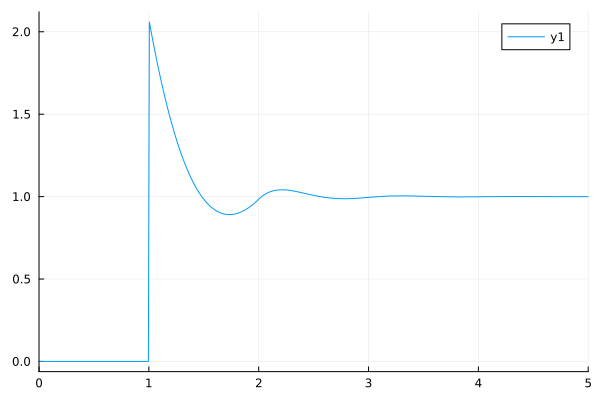

# OrnsteinZernike.jl
A generic solver for Ornstein-Zernike equations from liquid state theory

[](https://github.com/IlianPihlajamaa/OrnsteinZernike.jl/actions)
[](https://codecov.io/github/IlianPihlajamaa/OrnsteinZernike.jl)
[](https://IlianPihlajamaa.github.io/OrnsteinZernike.jl/stable)
[](https://IlianPihlajamaa.github.io/OrnsteinZernike.jl/dev)

One of the big triumphs in liquid state theory is the ability to approximate the structure of a liquid from the way its constituent particles interact. 
This can be done using the exact Ornstein-Zernike equation: 
$$h(r) = c(r) + \rho \int d\textbf{r}' c(\textbf{r}')h(\textbf{r}- \textbf{r}') $$

Here $h(r) = g(r) - 1$, where $g(r)$ is the radial distribution function, which describes the structure of a liquid, $\rho$ is the number density, and $c(r)$ is the direct correlation function. Together with an approximate closure relation, which links $c(r)$ to the interaction potential of the particles, this integral equation can be solved. 

This package implements common solution methods for the Ornstein Zernike equation, for single component systems as well as mixtures, in any dimension. It implements many predefined closure relations and many interaction potentials. Moreover, it let's you easily use your own closures and interaction potentials.

## Example use

Let's solve the Ornstein-Zernike equation for a single component three-dimensional system of hard spheres at number density $ρ = 0.5$. 

```julia
using OrnsteinZernike
dims = 3; kBT = 1.0; ρ = 0.5;
potential = HardSpheres(1.0)
system = SimpleFluid(dims, ρ, kBT, potential)
closure = PercusYevick()
sol = @time solve(system, closure);
```
which prints
```
After iteration 0, the error is 10.43964167059.
After iteration 10, the error is 1.27945927883.
After iteration 20, the error is 1.1281e-6.
Converged after 26 iterations, the error is 6.0e-11.
  0.004079 seconds (1.70 k allocations: 318.656 KiB)
```
Now that we have solved the equation, we can plot the solution:
```julia
using Plots
plot(sol.r, sol.gr, xlims=(0,5))
```


See the <a href="https://ilianpihlajamaa.github.io/OrnsteinZernike.jl/dev/">Documentation</a> for more details.

Please open an issue if anything is unclear in the documentation, if any unexpected errors arise or for feature requests. PRs are of course also welcome.

# Citing
If you use this software for scientific publications, please consider citing <a href="https://journals.aps.org/pre/abstract/10.1103/PhysRevE.110.044608">Pihlajamaa, I., & Janssen, L. M. C. (2024). Comparison of integral equation theories of the liquid state. Physical Review E, 110(4), 044608</a>. 
