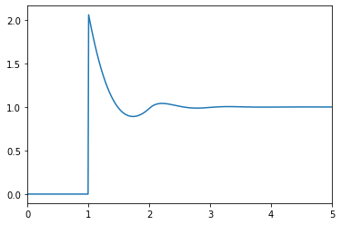

# Calling from Python

Using `OrnsteinZernike` from Python is straighforward

## Installing

First, install `juliacall` through the `pip` package manager, with

```bash
pip install juliacall
```
This package allows one to call julia from python 

In `Python` (only versions $\geq$ 3 are supported), run:

```python
from juliacall import Main as jl
```

which will install the latest stable version of Julia the first time it is called. Now install `OrnsteinZernike.jl`, with

```python

jl.Pkg.add("OrnsteinZernike")
```

To import this package in order to use it we need to run:

```python
jl.seval("using OrnsteinZernike")
```
The `jl.seval` function let's us evaluate any julia code from within Python.

## Usage

We can now use OrnsteinZernike.jl in Python:

```python
dims = 3
kBT = 1.0
rho = 0.5
potential = jl.SingleComponentHardSpheres()
system = jl.SimpleLiquid(dims, rho, kBT, potential)
closure = jl.PercusYevick()
sol = jl.solve(system, closure)

import matplotlib.pyplot as plt

plt.plot(sol.r, sol.gr)
plt.xlim(0, 5)
plt.show()
```



See the documentation of [juliacall](https://pypi.org/project/juliacall/) for more information on how to call Julia from Python.
