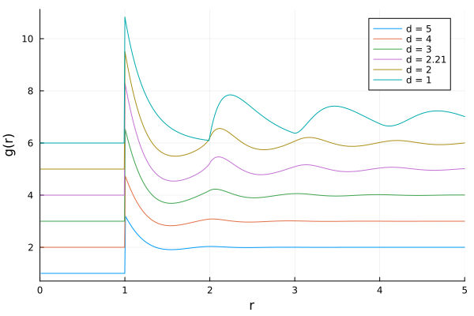

# Other dimensions 


The solver is written for arbitrary dimension. This means that it is straightforward to solve  for other-than-three-dimensional systems. Let's for example solve the equations for hard (hyper)spheres in different dimensions, and see what the results look like

```julia 
using OrnsteinZernike, Plots
densities = [0.8, 0.8, 0.8, 0.8, 0.8, 0.8]
dimensionalities = Any[5, 4, 3, 2.21, 2, 1]
p = plot(xlims=(0,5), xlabel="r", ylabel="g(r)")
for i = 1:6
    density  = densities[i]
    dimension = dimensionalities[i]
    potential = HardSpheres(1.0)
    kBT = 1.0
    system = SimpleFluid(dimension, density, kBT, potential)
    closure = PercusYevick()
    method = DensityRamp(NgIteration(), range(0.001, density-0.1, length=10))
    sols, = solve(system, closure, method)
    sol = sols[end]
    plot!(p, sol.r, sol.gr .+ i, label="d = $dimension")
end
p
```


Currently, however, noninteger dimensions below 2.0 are not supported.
